# PanelReader App

Mobile and backend solution for vehicle monitoring in field operations through automated dashboard data scanning.

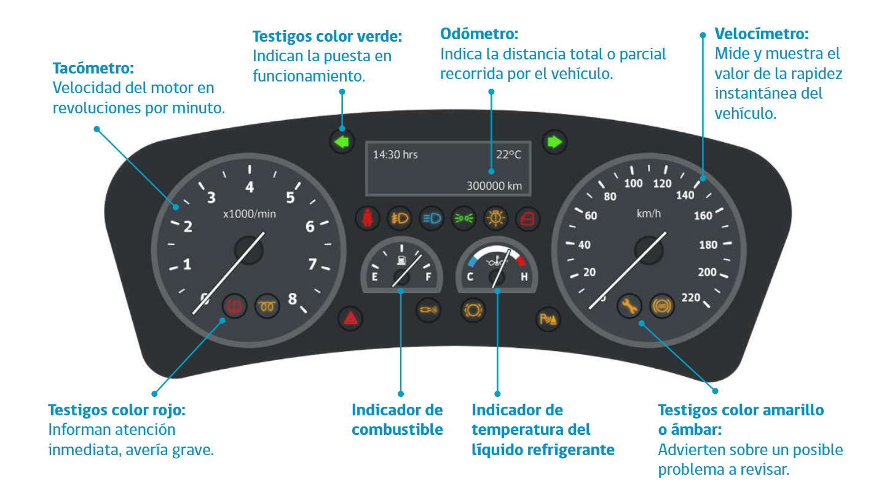

## Overview

PanelReader App is a software solution designed to streamline vehicle monitoring and fleet control in field operations. The platform enables transport operators to capture and centralize key dashboard information such as:

- Odometer readings
- Fuel range
- Vehicle operational data
- Certification status

The system was designed to operate reliably even in low-connectivity environments.

---

## System Architecture

The solution consists of three main components:

### Mobile Application

A mobile application used by field operators and drivers to scan and register vehicle dashboard information.

#### Features

- Dashboard data capture
- Offline-first architecture
- Local data persistence when internet access is unavailable
- Automatic synchronization once connectivity is restored
- Simple interface optimized for field operations

---

### Backend Platform

A centralized backend system responsible for processing and storing all incoming operational data.

#### Responsibilities

- Data reception and validation
- Vehicle information management
- Synchronization handling
- Centralized fleet monitoring
- API services for analytics and dashboards

---

### Analytics Dashboard

A monitoring dashboard developed for operational visibility and alert management.

#### Capabilities

- Fleet monitoring
- Vehicle status tracking
- Expired certification alerts
- Operational reporting
- Data visualization through Power BI

---

## Technologies

- Mobile Development
- Backend API Services
- Database Management
- Power BI Dashboards
- Offline Data Synchronization

---

## Screenshots

### System Architecture

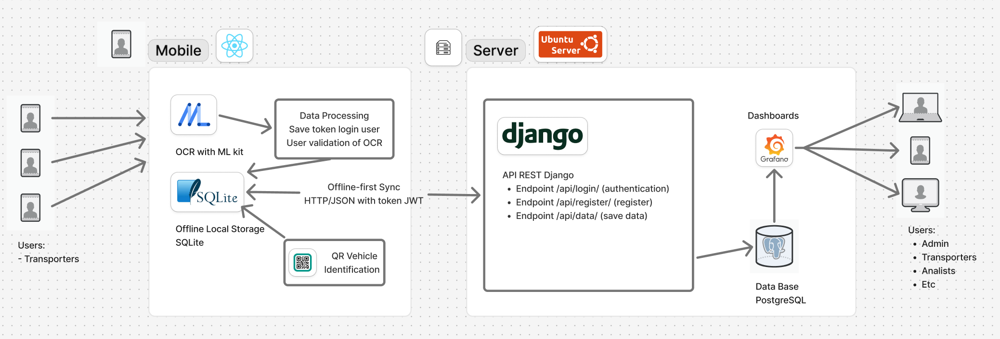

### Mobile Application

  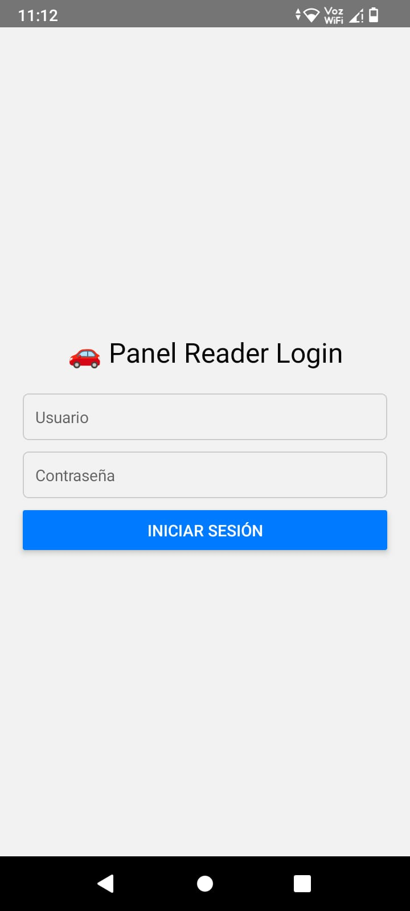
  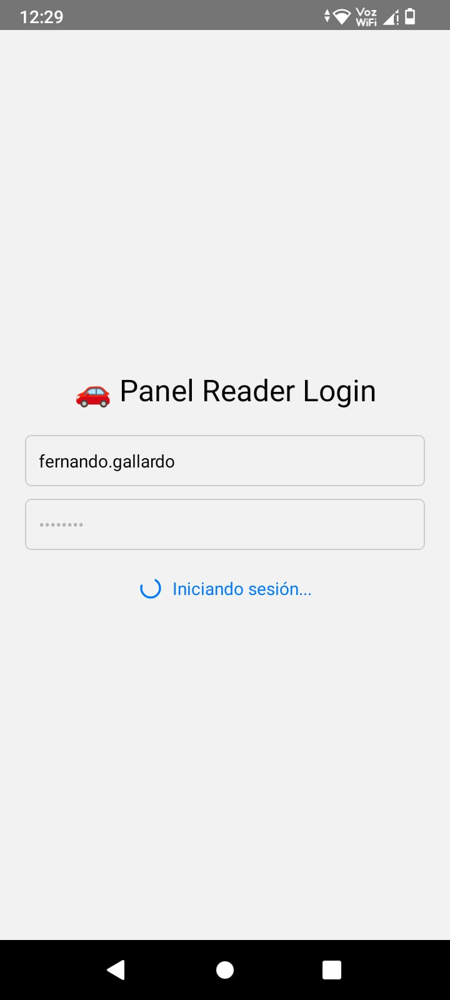
  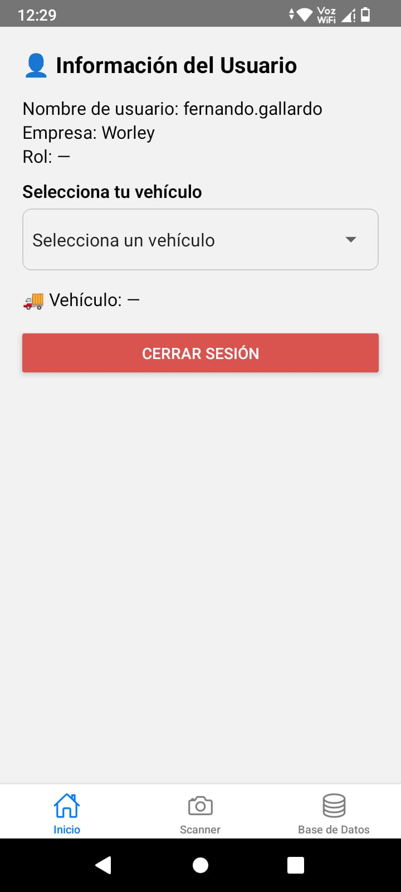
  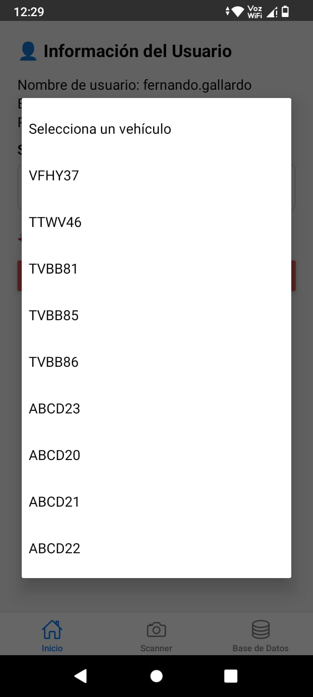
  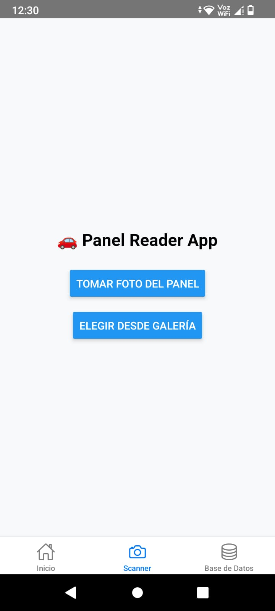
  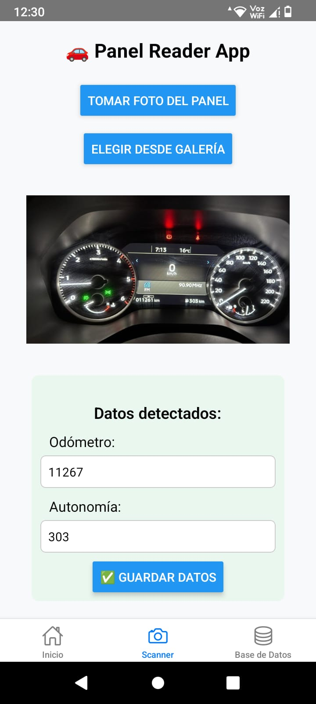
  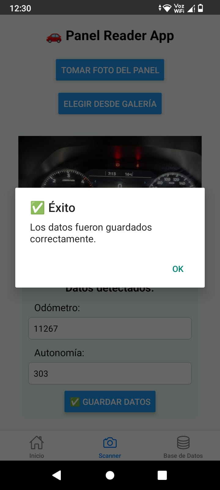
  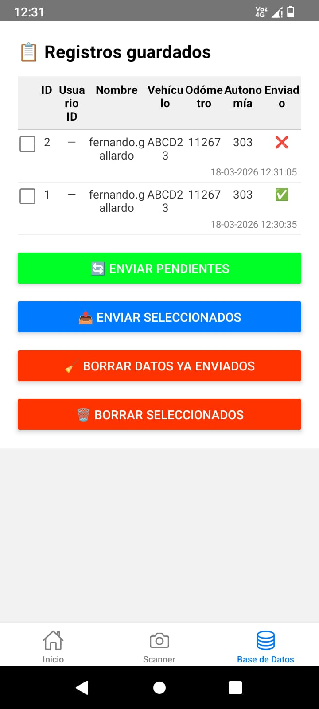

### Database Administration

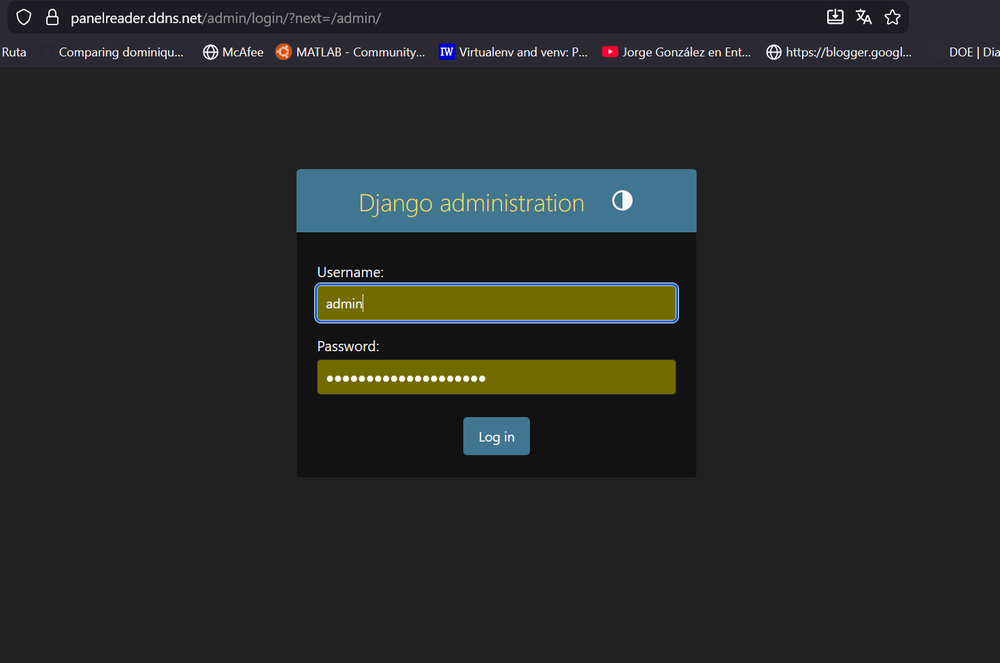
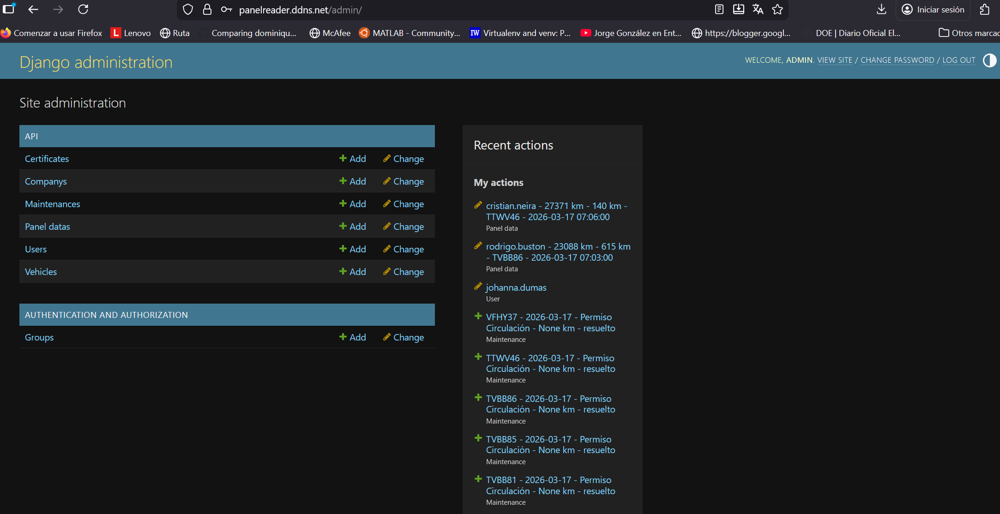

### Database Model

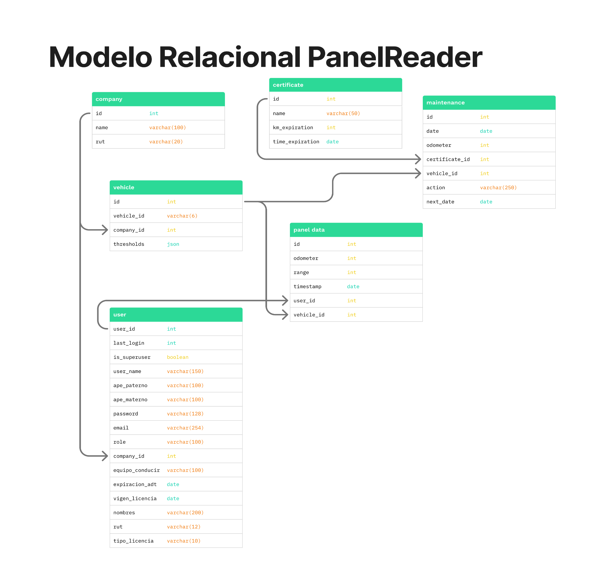

### Dashboard

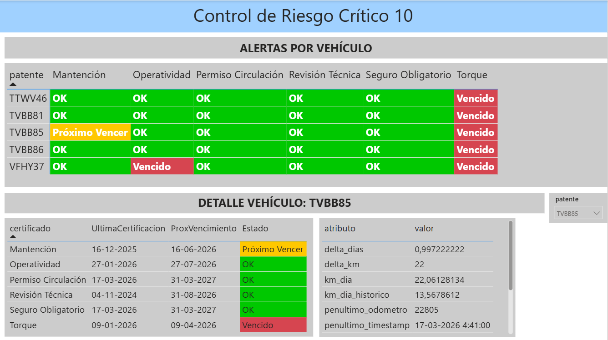

---

## Project Goal

The objective of the project is to improve operational visibility and fleet compliance management by digitizing vehicle data collection and enabling proactive monitoring through centralized analytics.
